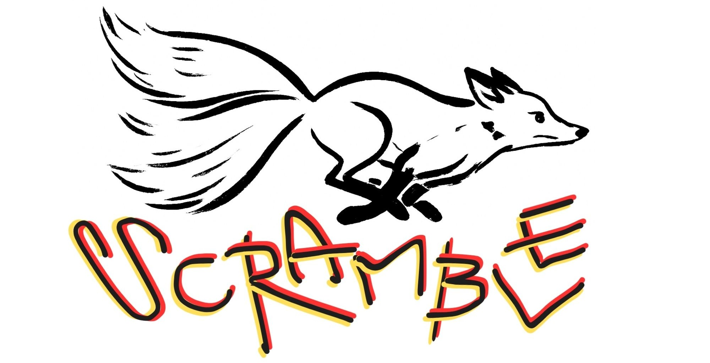
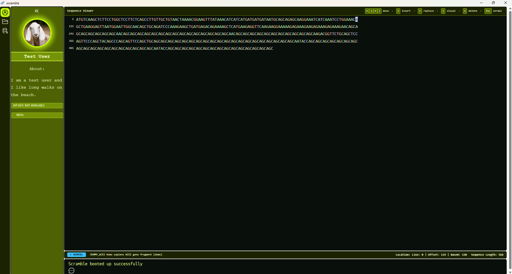
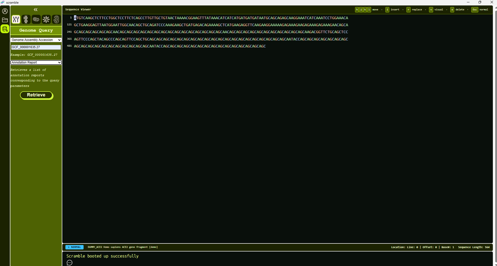

## Scramble
----

-----
### Project ongoing👷🛠️
### What is scramble
Scramble is a desktop application for working with nucleotide sequences. It is both a tool for organisation and storage of your own data but also allows for you to access publicly available data over the NCBI Datasets API. The first implementation will focus on storing your data locally making this an isolated application you can also run offline for increased security.

### Upcoming features
1. Rust Backend
    While the Frontend is written in Typescript, using the Angular Framework, the backend in Rust will take care of the heavy lifting when working with your nucleotide data.
2.  Codon Integration
    Scramble will store data using Codon (https://github.com/PauMerr95/codon), a c++ nucleotide encoding library that also allows for manipulation in the encoded format.
3. Prioritising workflow
    Scramble is prioritising a smooth workflow while still allowing for a high degree of flexibility to its user. This is also the reason why scramble aims to allow for a mouseless experience, using an expandend set of vim motions and pseudo in-app commandline features (searching an open file with /AGT or /"filename.fasta").

### Sneakpeak (open to changes)

#### User Pane

#### Query

### Project Philosophy

1. AI
    This is first and foremost a non-AI project aiming to provide the best human-slop possible. However, AI is a tremendous tool whose advantages cannot be ignored. In this project AI might be used for the following:
    - brainstormin
    - designing test plans or drafts
    - supporting basic code review
    - creation of placeholder images that ought to be removed at some point

    Scramble aims to avoid AI for the following:
    - writing code
    - writing tests
    - writing pull requests
    - writing commit messages

    The reason being ...
    > (A) Scramble is made by and for enthusiasts: using AI to carry the fun parts makes the experience meaningless.
    > (B) An overreliance of AI will lead to a loss of understanding and maintanability of the source code.
    > (C) No one likes to weed through hollow pull requests and commit messages.

2. Made for everybody
    This project will always remain open source and free to use in its entirety.

3. Contribution
    Currently this project is still closed to outside contributions but will eventually accept the following:
    - Code Contributation
    - Artwork Contribution
    - Ideas and Improvement Plans Contributions via Github Issues
  